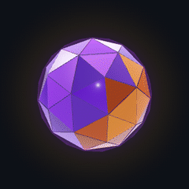

<h1 align="left">♣️ Welcome, stranger! Got a selection of good things on sale!</h1>

<table>
<tr>
<td width="62%" valign="top">

Oi, eu sou o **Gabriel Barros**, mas pode me chamar de **Medusa 🐍** — ou de **MedusoDev**, o nome da loja.

Sou **desenvolvedor full stack & mobile**, formando em Ciência da Computação (2026). Há 2 anos estou na TI da Secretaria de Educação de Alagoas, entre sistemas em produção (React, TypeScript, MySQL) e suporte técnico.

Fora do expediente, crio coisas: o **[Codolin](https://codolin.web.app)**, um app para aprender programação jogando, e jogos como o **CabaDaPeste**, 1º lugar na GameJam UNINASSAU 2025.

🔗 **[gabrielbarros-portfolio.vercel.app](https://gabrielbarros-portfolio.vercel.app)**

</td>
<td width="38%" align="center" valign="middle">

<b>o icosaendro</b> — minha marca roxo é dev, âmbar é game

</td>
</tr>
</table>

<h2 align="left">♠️ What're ya buyin'? — vitrine</h2>

| | Projeto | O que é |
|---|---|---|
| 🦎 | **[Codolin](https://codolin.web.app)** | App de estudo gamificado: lições curtas, revisão espaçada, XP, sequência e seis linguagens, de C# a C++. React Native, Expo e TypeScript, no celular e na web. |
| 💎 | **[Portfólio](https://gabrielbarros-portfolio.vercel.app)** | O lar do icosaendro: uma gema 3D em Three.js que gira a cada seção, dorme quando você some e acorda assustada. Next.js. |
| 🔥 | **[CabaDaPeste](https://github.com/MedusoDev/CabaDaPeste)** | Jogo em Unity inspirado no Lampião. **1º lugar na GameJam UNINASSAU 2025**: estruturei os sistemas e o núcleo do gameplay. |
| 🧭 | **[DevQuest](https://github.com/MedusoDev/dev_quest)** | Versão do Codolin feita como projeto da faculdade. |

O código do Codolin e do portfólio é privado; os links levam ao projeto no ar.

<h2 align="left">♦️ No balcão — o que eu uso</h2>

  
  
  
  
  
  
  
  
  
  
  
  
  
  
  

 

  
  
  
  
  
  
  
  
  
  
  

<h2 align="left">♥️ Um pouco sobre o mercador</h2>

🎮 Gamer de jogos 2D, Soulslike e narrativas profundas. *Life is Strange* marcou minha vida de um jeito único.

🌒 Orgulhosamente noturno: produzo melhor quando a madrugada está em silêncio e o mundo parece em pausa.

🎶 "Se agradar meu ouvido, eu estou ouvindo." Rare Americans, Indigo & the Sirens, Mystery Skulls, Kamaitachi.

🧩 Resolvo problemas como quem monta quebra-cabeça: se a peça não existe, eu crio uma nova.

📚 Colaborei no artigo científico *[Explorando espaços de aprendizagem no metaverso: um estudo sobre tecnologia, design e ergonomia](https://ojs.observatoriolatinoamericano.com/ojs/index.php/olel/article/view/7383)*.

 

<h2 align="left">♣️ Fale com o mercador</h2>

  
  
  

 

<i>Heh heh heh… thank you!</i>

